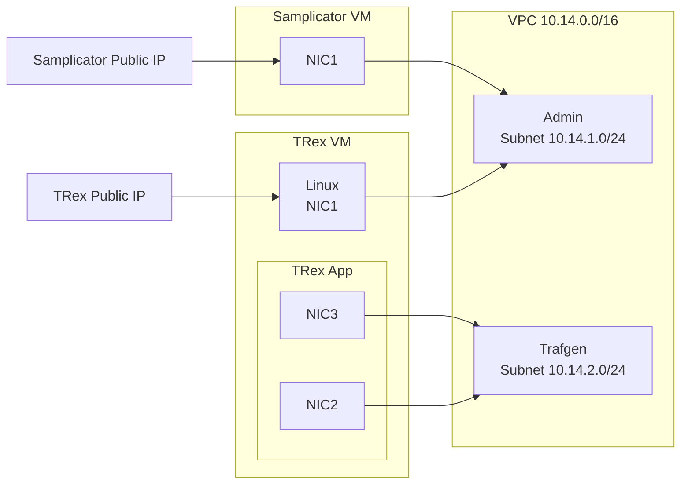

# Cisco TRex on AWS EC2 with Samplicator UDP relaying

A Terraform plan and shell scripts to install two virtual machines
TRex Load Gen
- RHEL 8
- Cisco TRex

Samplicator UDP Relay
- RHEL 8
- Samplicator



## Configuration

### Create credentials out of tree

```shell
mkdir ../aws_credentials
```
Sample shared_credentials_file.tfvars
```
[default]
aws_access_key_id=YOUR_ACCESS_KEY
aws_secret_access_key=YOUR_SECRET_ACCESS_KEY
```

Provide sshkey in YourSshKey.sshkey file

### Create aws_trex.tfvars

Copy and edit values in aws_trex.tfvars.sample
```
cp aws_trex.tfvars.sample aws_trex.tfvars
```

Sample values
```
key_name        = "YourSshKey"
public_key_path = "../aws_credentials/YourSshKey.sshkey"
aws_shared_credentials_file = "../aws_credentials/shared_credentials_file.tfvars"
allowed_inbound_cidr = {"inbound_cidr": "YourNetworkAddress/mask"}
trex_bundle_url = "https://trex-tgn.cisco.com/trex/release/latest"
dpdk_setup_file = "artefacts/dpdk_setup.sh"
samplicator_conf_file = "artefacts/samplicator.conf"
samplicator_service_file = "artefacts/samplicator.service"
samplicator_bundle_url = "https://github.com/sleinen/samplicator/releases/download/v1.3.6/samplicator-1.3.6.tar.gz"
samplicator_bundle_dir = "samplicator-1.3.6"
```

### Specify credentials and ssh key in tfvars

Provide AWS access key in ```aws_trex.tfvars```
```
aws_shared_credentials_file = "../aws_credentials/shared_credentials_file.tfvars"
```

Provide ssh key in ```aws_trex.tfvars```
```
key_name        = "YourSshKey"
public_key_path = "../aws_credentials/YourSshKey.sshkey"
```

### Specify address range for inbound ssh access to instances in ```aws_trex.tfvars```

allowed_inbound_cidr = {"inbound_cidr": "your_net_range/mask"}

### Samplicator relay addresses
Modify [artefacts/samplicator.conf](artefacts/samplicator.conf)

```
<IP of Trex VM>/255.255.255.255: <Target IP>/<Target Port>/1
```


## Create instances

```
terraform apply -auto-approve -var-file=./aws_trex.tfvars
```

## Running TRex

### Create /etc/trex_cfg.yaml

Configure interfaces with IP address and MAC assigned to eth1 and eth2 interfaces

Determine IP and MAC for eth1 and eth2
```
sudo -s
ip addr show eth1
ip addr show eth2
```

Set these in TRex interface config
```
sudo -s
cd /opt/trex/v3.04
./dpdk_setup_ports.py -i
```

### Launch TRex

```
sudo -s
cd /opt/trex/v3.04
./t-rex-64 -i --astf --lro-disable 
```

or in Emulation mode
### Launch TRex

```
./t-rex-64 -i --astf --emu --lro-disable 
```

### Use emulator to generate IPFIX traffic

Launch t-rex-64 in emulator mode, then

```
./trex-console --emu
emu_load_profile -f emu/simple_ipfix.py -t --4 10.14.2.49 --dg-4 10.14.2.1 --dst-4 10.14.2.228

```

View IPFIX generation
```
trex>emu_ipfix_get_gen_info -p 0 --mac 06:4b:c4:9c:b1:17
Generators

Name | Temp. ID | Enabled | Opt. Temp. | Scope cnt | Temp. Rate | Data Rate | # Records spec. | # Records calc. | # Fields | # Engines
-----+----------+---------+------------+-----------+------------+-----------+-----------------+-----------------+----------+----------
mix1 |   261    |  True   |    True    |     1     |     1      |     1     |        2        |        2        |    3     |     2
mix2 |   266    |  True   |   False    |     0     |     1      |   0.500   |        5        |        5        |    3     |     3
```

# To do

- Automatically create trex_cfg.yaml from assigned IPs/MACs
